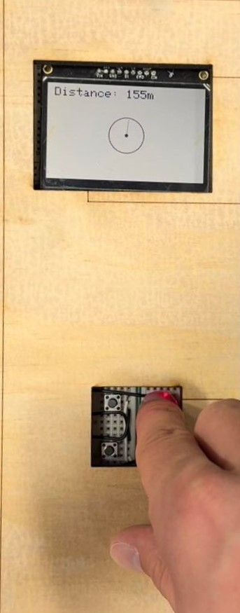

# Ben Worklog
This is the worklog (by week) of Ben Olaivar. 

# 01/22/2024
Mostly tossing around new ideas. I've decided to form a team with _MAX KRAMER_.

An idea I've been wanting to do for a while is a handheld rocket tracker. I was part of the Illinois Space Society (ISS) and I remember recovery being a huge pain. We usually use a telemetrum(below):

  
Source: https://altusmetrum.org/TeleMetrum/

I also found this solution online: [Link](https://www.apogeerockets.com/Electronics-Payloads/Rocket-Locators/Simple-GPS-Tracker). Pretty cool idea but super expensive and clunky:
* To change frequency, you have to open the casing and flip a bunch of switchees
* To navigate the menu, the user has to flip/twist the device around (making use of the internal accelerometer)...not intuitive at all.
* Very expensive ($475).

  
Source: https://www.apogeerockets.com/Electronics-Payloads/Rocket-Locators/Simple-GPS-Tracker

My idea is to create a more affordable, more intuitive versin of this device.

# 01/29/2024
*Got a new teammate: **MANAS TIWARI**. Mostly completing RFA/CAD/SOLDERING ASSIGNMENTS.*

# 02/05/2024
Proposal and team contract. We've voted to have me as the leader for the time being. I'm most familiar with the project, so I can get the ball rolling/guide the rest of the team. We haven't decided if I'll keep this role.

Our meeting this week was getting a Bill Of Materials (BOM). This will significantly help us in ordering parts/designing our PCB moving forward. The BOM can be found [here](https://docs.google.com/spreadsheets/d/1sEjC53fU_5GEq1jBt58OX4yNWLMCd0l3RfI5yEBmx-o/edit?usp=sharing]).

# 02/12/2024
This week our main goal was designing the PCB. I was tasked with completing the User Interface and MCU schematics seen below:
* We're using the Atmega328p for our MCU. If we damage this chip, we can easily replace it for free from the ECE shop. Plus, it's pretty easy to use
* The User Interface is primariliy pushbuttons. As for the display, we'll be using a breakout board. All I need to do is include some female pin headers. We currently have a bunch of numbers so the user can type in their desired frequency...This may change considering the narrow frequency band of 433.0-434.8 MHz

  
^MCU Schematic  

  
^User Interface Schematic

**MAX KRAMER** has been tasked with doing the *Power* subsystem, while **MANAS TIWARI** has been tasked with the *Sensors* and *Communication*.

# 02/19/2024
This week has been mostly Design Document and Presentation work. Unfortunately we've already ran into an issue with our partner **MANAS TIWARI**. Of the ~31 pages of our Design Document he's only written 4ish, and even that has been a struggle. He consistently hasn't done his fair-share of work, and what work he DOES do is not sufficient and often needs to be rewritten. Plagiarism has been a recurring concern. My reasoning:
* When I assigned him a subsystem to write about, he pasted in a paragraph with the heading *"GPT output"*, and asked me to review it. 
* His "notes" on RF components, which he intended to put on the design document, were clearly not his. It looked like something a webscraping tool/chatbot would output, and there were inconsistent fonts and text sizes, indicating he copy and pasted the material. Additionally, he provided no sources. When I asked him about this, he swore he didn't use chatGPT, and that he understood all the information. However, it was clear he didn't understand the material, and could not explain any of the information.
* When asked to complete the Requirements & Verification table for the Communication subsystem, he simply copied the table I wrote for the Sensor subsystem, and added a couple extra bullet points. Word-for-word copy-paste (seen below).

  
^My R&V table for Sensors

  
^The R&V table Manas "wrote"

We brought up these concerns with Manas in a professional manner. We allowed him to defend himself, and he denied using chatGPT to get his answers.

I can excuse not being knowledgeable on this subject (RF is new to everyone on this project), but I can't excuse cheating. I can't allow this kind of material on my project, as it could result in consequences from the department. Max and I had to commit considerably more time to the project than we had planned (doing Manas's work on top of our own), which was ver frustrating. We will bring this up with the TA if it continues to be an issue...

# 02/26/2024
Still waiting on parts... mostly working on placeholder code for testing. Once components come in we'll do some testing on breadboards with an arduino.

Placeholder GPS loop code found in the gps_dev branch:  

    lastTime = millis(); //Update the timer
    long latitude = myGPS.getLatitude();
    Serial.print(F("Lat: "));
    Serial.print(latitude);

    long longitude = myGPS.getLongitude();
    Serial.print(F(" Long: "));
    Serial.println(longitude);
    

# 03/04/2024
Components are in. We've met to divvy-up tasks. I'm tasked with getting the screen and GPS working. 

## Screen: 
I'm using the [Adafruit GFX](https://learn.adafruit.com/adafruit-gfx-graphics-library/overview) and [Adafruit SSD1306](https://github.com/adafruit/Adafruit_SSD1306) libraries (The 1306 chip is the driver for the display). The screen we're using is the [Adafruit SHARP Memory Display Breakout](hhttps://www.adafruit.com/product/3502?gad_source=1&gclid=Cj0KCQiAh8OtBhCQARIsAIkWb69EURgM6rmca89h0awIIWxgg5zLOwVgstbSv928fPMusonH9j-yh3AaAjCxEALw_wcB) seen in the picture below. It's pretty small, but it gets the job done. I got it working with some dummy code below.

On the left is the "compass". Right now it's just a dot, which acts as the center, and a line, which acts as an "arrow". Line points in the direction of the beacon. In the top right I have the distance readout from the handheld tracker to the beacon in meters.

  

## GPS
GPS has been pretty easy. The placeholder code from above works great. This was an example pulled from the [Sparkfun Library](https://github.com/sparkfun/SparkFun_Ublox_Arduino_Library?utm_source=platformio&utm_medium=piohome). With some slight modifications to the code, I can save the *longitude* and *latitude* into global variables. the `getLongitude()` and `getLatitude()` return longs, which outputs coordinates like this: `Lat: 401143435, Long: -882273428` Instead of how they would normally be seen, like this: `Lat: 40.1143435, Long: -88.2273428`. Not a huge deal, just need to convert to floats and divide by 10000000.

I've noticed that the GPS library takes up a TON of memory. During compilation, the GPS code takes up **76%** of our available RAM.

## Distance between two coordinates
To calculate the distance between two points I'm using the [TinyGPSPlus Library](https://github.com/mikalhart/TinyGPSPlus). This library has a great function called `distanceBetween(double lat1, double long1, double lat2, double long2)`, which takes the latitude and longitude of two points, and calculates the distance between *accounting for the curviture of the earth*. This is incredibly useful considering our desired accuracy of 5 meters. This will come in handy for distances of a mile+.

# 03/11/2024
Spring break...not much was done. Boards have been delivered and are sitting in the lab.

# 03/18/2024
The boards have been delivered. **MAX KRAMER** and I have gone to the lab to construct and test the boards (Max doing the soldering, and me the testing). Because we're using so many GPIO pins for our User Interface Pins, we weren't able to fit a USB interface, to the board. Instead we've broken out the already-in-use SPI pins. In the past I've used an arduino to upload to other boards.

## Arduino as ISP
Arduino as ISP uses the SPI lines on the arduino to transfer a program from a primary board to a secondary one. This is done using the wiring of SPI/reset wires seen below:

  
https://www.instructables.com/Programming-Arduino-With-Another-Arduino/

I have tried following the tutorial above, however I'm getting the following error:
>avrdude: stk500_recv(): programmer is not responding
avrdude: stk500_getsync() attempt 1 of 10: not in sync: resp=0x03
avrdude: stk500_getsync() attempt 2 of 10: not in sync: resp=0x66
avrdude: stk500_getsync() attempt 3 of 10: not in sync: resp=0xe0
avrdude: stk500_getsync() attempt 4 of 10: not in sync: resp=0x66
avrdude: stk500_getsync() attempt 5 of 10: not in sync: resp=0xe0
avrdude: stk500_getsync() attempt 6 of 10: not in sync: resp=0x66
avrdude: stk500_getsync() attempt 7 of 10: not in sync: resp=0xe0
avrdude: stk500_getsync() attempt 8 of 10: not in sync: resp=0x66
avrdude: stk500_getsync() attempt 9 of 10: not in sync: resp=0xe0
avrdude: stk500_getsync() attempt 10 of 10: not in sync: resp=0x66
Problem uploading to board.  See https://support.arduino.cc/hc/en-us/sections/360003198300 for suggestions. 

**MAX KRAMER** met several times this week to figure out what was going on. It turns out that our external 16MHz clock was not oscillating. We tried to work around this by removing the 16MHz clock and tried using the internal 8MHz. Again, we got the same error as above.

Our schematic for the MCU is almost identical to schematics we found online (of working projects AND Arduino's official website). After meeting several times and having no luck, we decided to omit the MCU on the PCB, and instead focus on the core features of our project.

# 03/25/2024
Met this week to discuss the work **MANAS** has done on the menu so that I can start integrating everything together. Below is the general outline of the menu Manas designed.

This is a pretty good outline, however the code that was written was never actually tested, so unfortunately it didn't work. This was pretty frustrating considering the amount of time Manas had spent on it (it's just a simple menu). I asked if he had done any debugging, and he said that no, he had never actually uploaded and tested on the Arduino. 

The core idea of the menu was there, and I could easily follow the outline Manas made, so I ended up rewriting the code myself. Again, this was incredibly frustrating considering the time I had spend testing the other components/making sure they work, and he never tested the code once. While I fixed this code, I tasked Manas with getting the radio code up and running. He was given the radio and arduino for testing.

Here are the final results of the menu:
## Main Menu

## Compass

## Frequency Change Menu

## Editing Frequency

## Attempting Frequency Change

## Frequency Change Success

# 04/01/2024 - 04/15/2024
Everything is working in isolation, so we need to integrate all together to prepare for the Mock Demo. I'll be in charge of this.

## Radio Testing
Huge thanks to **Max Kramer** for finishing the radio code. Since last week, Manas was unable to get the radios to work. As it turns out, he didn't have a bread board, and never actually tested the radio module (As of Tuesday). On Tuesday he picked up a new breadboard and went to work. We met again on Friday, and he hadn't gotten the code working (after checking the git, he had not made any changes. This led us to believe he didn't do anything, so Max finished the code instead).

Max got the radio code working, and we did some general range/frequency change testing on eng quad. This was primarily Max doing the testing. I was mostly there to hold radios while he tweaked the code.

## Memory Issues
I mentioned this a couple weeks ago, but the GPS library takes up over 76% of our RAM (1560 bytes). This is a problem because our display requries 1KB (50%) of our RAM to operate.

It turns out that the SparkFun GPS library is designed to cover ALL their gps devices (they make several). This wasn't really meant to be efficient, it was just meant to get the job done. There are debug print statements throughout the entire library (which take up a TON of memory), and there are dozens of global variables. Many of these global variables are longs/uint32_t's, which take up a lot of space. I went through and deleted all these unneeded variables/functions/prints.

The new memory size of the gps is only 42% of our RAM, which I think is as small as I'm going to get it. This is small enough to integrate our menu, display, and gps code all on one atmega chip.

## Mock Demo
Mock demo went well. We just need to improve some of our radio/change requency functions and we should be good for final demo. Sanjana also suggested getting a case for our project, even if it's just on a breadboard.

# 04/22/2024
This week has mainly been prepping for the final demo. Cleaning up code, finalizing integration, and building the case.

## We broke the screen
Somehow while transporting the project I damaged the display. The corner of the display cracked, and now data won't display unless you push on the screen in a very particular way (and even then it doesn't really work).

I called up a friend who's using a similar display on a personal project. He let us borrow his display for the final demo. Lucky for us, it actually uses the same Adafruit_GFX library that we used for our original display. 

We've gone from a 128x32 pixel display to a 400x240 pixel display (WAY BETTER RESOLUTION). Seen below. The logic for all the menus remains the same, we just had to adjust sizing and text thickness. 

  
^Source: [Adafruit](https://www.adafruit.com/product/4694?gad_source=1&gclid=Cj0KCQjw0MexBhD3ARIsAEI3WHKC6rK1eA4tJuoVFEdSgEgJBttDaHFF8nRq-e7qUTQ-WK-mqFdtqH8aAtFxEALw_wcB)

## 3D modeling/Laser cut case
The project completely works on breadboards. We just need do design the casing. I'm not very good at 3D design, so I use a simple online 3D design tool called onshape. It's pretty easy to use and its free (plus tons of tutorials online). I'm using it to CAD each side of our box, which will be laser cut from a 1/4inch plank of ply wood. Here are a few screenshots of our cases:

## Tracker Case
  

## Beacon Case
  

Once I finished the designs for each wall face, I used the laser cutter in Siebel to cut out each face. Max and I used hot glue guns to attach the edges together.