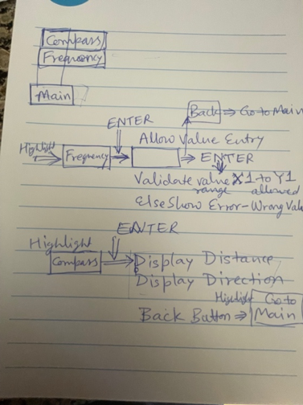
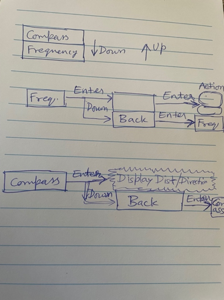
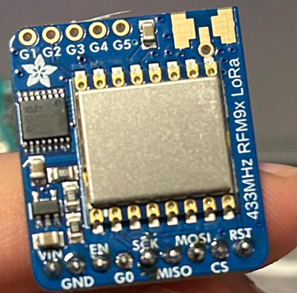
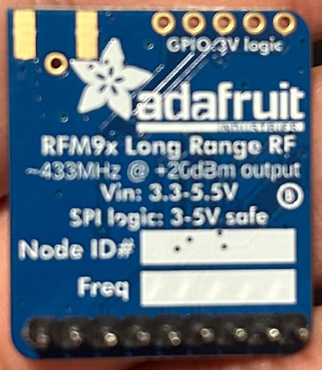

# Manas Notebook Entries – ECE 445 - Spring 2024

# Jan 17 : Submitted Idea – Elderly Fall Detection

I submitted my idea with some details on the Web Board. This idea is about detecting and notifying for elderly, consisting of a simple wearable device containing a range of LIDAR sensors, accelerometers etc. and integrate them with PCB and demonstrate data collection from sensors. Need some help from the TAs on how to approach building such a solution.
It seems to be better to prioritize looking for the right partners. Posted that I’m looking for groupmates on the web-board. 

# Jan 24/25 : Forming Group and Early Approval - Handheld Rocket Tracker Project

Exchanged messages with Max to join their idea “Handheld Rocket Tracking”. This handheld device will have a GPS + Magnetometer + transmitter/receiver. With the sensors, the handheld will be able to receive the location of the puck in rocket, relative to itself, as well as the user's heading. Some concerns on where I would fit into this project considering I have limited experience in this field, but hoping we can work it out. Project has early-approval - Team #16

# Feb 1 : Team Meet - Identify major parts of project and assignment

We met as a team and brainstormed the sub-systems we would need. Ben seems to be the most knowledgeable about the project. Suggested sub-systems in meeting are  –

1.	Battery to power all the parts 
2.	Sensors to collect GPS locations 
3.	Micro-processor to run the code
4.	RF (Telemetry) module – for signal transmission

# Feb 4 : Telemetry Design – Antenna basics and frequency band
 
Went through a few links to understand basic features of antennas, frequency bands that antennas can use. There seem to be a lot of things to take into account while picking the exact antenna needed for our project. I asked for Ben’s input on how to make a selection, and he said that he had experience working with LoRa in the past, and would like me to research antennas that would work with it. Went through relevant antenna options for our use case.
Description of Long Range antennas (LoRa) and long range communication. Battery requirements details for these antennas.

1.	https://www.electricity-magnetism.org/yagi-uda-antennas/#:~:text=Applications%20of%20Yagi%2DUda%20Antennas,signal%20strength%20is%20relatively%20weak
2.	https://www.linkedin.com/pulse/how-choose-best-antenna-lora-ct-rf-antennas-inc/
3.	https://lcantennas.com/8-dbi-antenna-lora-high-gain-antenna/

# Feb 6 : Proposal info - LoRa antenna features

Ben is taking charge of designing the PCB schematics with Max helping him to do so. KiCAD not running properly on my laptop, which limited the amount I could help with.
Working on adding telemetry in the proposal document.

Spoke to an antenna manufacturer (lcantennas) to get cost and time for order etc.
Draft proposal sections for my section is ready. Below links also used to get more info.

1.	https://medium.com/home-wireless/testing-lora-radios-with-the-limesdr-mini-part-2-37fa481217ff 
2.	https://www.apogeerockets.com/Electronics-Payloads/Electronics-Accessories/433-Mhz-Yagi-Antenna
3.	https://www.data-alliance.net/433mhz-antennas/
4.	[https://lcantennas.com/how-to-choose-the-best-antenna-for-lora/

# Feb 8 : Revision and Submission of Proposal

Working on the Proposal and Design Document. 
Added some more sections on Ethics - guideline and sent info about battery pack we plan to use. Final version of Proposal submitted.
Worked on first draft of Team contract.

# Feb 9 : Team contract – Team #16

Met as team to go over the team contract, added a few sections.
We revised and agreed on each sections, assignments and options to resolve issues.

Submitted final version of Team contract – my part Telemetry, antenna specs.
I proposed taking up any more modules as we progress.

# Feb 16 : Telemetry Design – Alternatives for LoRa Antennas (frequency, gain, range)
 
Went through below links to get more info and find alternatives. Discussed with the team to finalize. Read testing details and alternatives for antenna.
Frequency band selection – 433 MHz, Gain and Longer range

1.	https://www.raypcb.com/lora-antenna/#:~:text=The%20most%20prevalent%20LoRa%20antennas,collinear%20antennas%20also%20see%20use
2.	https://www.electricity-magnetism.org/yagi-uda-antennas/#:~:text=Applications%20of%20Yagi%2DUda%20Antennas,signal%20strength%20is%20relatively%20weak

# Feb 18-19 : Telemetry Design – Choices, Selection of Antenna, Mounting options

1.	https://lcantennas.com/how-to-choose-the-best-antenna-for-lora/
2.	https://www.linkedin.com/pulse/how-choose-best-antenna-lora-ct-rf-antennas-inc/

Other than accuracy and range, we’ve more criteria for antenna selection -

•	Space limitation on the rocket and handheld tracker
•	They should work in outdoor setting (higher temp variation and weather conditions).
•	Mounting of antenna should be possible on PCB at Handheld and Rocket so antennas should be compact and easy to mount.

Completed Telemetry sections of the design document.

# Mar 1 : Antenna part selection (1st round PCB order) – Handheld and Rocket beacon

In the team meeting, we came up with hardware for individual sub-systems.
I verified antenna parts and other criteria with Customer Support at LcAntennas.com
Since delivery and cost were within our requirements, finalized order for antennas. 

# Mar 6 : Backup Antenna part selection

Went over other similar antennas at lcantennas.com
Spoke to customer support and identified one more option for both antennas (at tracker and rocket) which we could order and replace quickly if our test results do not go well.

# Mar 17 : GPS memory - Issue

Ben has notified us about an issue where the GPS seems to be using around 75% of our chip’s memory. We have discussed implications and have decided to move to using a smaller screen for our project in order to save memory. Also looking into the possibility of reducing the GPS library’s memory usage.  

# Mar 18 : Building/ Soldering board 

Ben and Max have been working on soldering the parts received onto the board. No help required from my side. Once they put together all the different parts, we will have the board ready for testing. Most of the parts we ordered have been delivered.

# Mar 25 : UI Menu Navigation – Additional assignment for me

After asking Ben for more work, Ben has assigned working on coding the menu logic. To test this, I needed to learn how to load the code in Arduino. The inputs would be provided by pushbuttons, which it should be hooked to the Arduino in order to test.
Button probing already exists. Code in C++. This week - Pseudo Logic is due

Explored sample code on Arduino board that looks relevant -

https://roboticsbackend.com/arduino-push-button-tutorial/

# Mar 27 : Programming Failing to occur – Issue 

Ben has still been running into issues while trying to program the chip using the Arduino. Still  not entirely sure on why it is happening. We discussed some potential reasons and decided to focus on our individual work to keep progressing. Discussed bringing this issue up with the TA since none of us are too familiar on why this error is occurring.

# Mar 29 : Team meeting – Menu navigation and info display on Handheld Tracker

Discussed the menu options, and the logic on how to traverse between menus. Add some temporary methods to main.cpp
Logic to show a basic menu showed to me by Ben. Involves printing in a loop, with user input simulated by using a wire hooked up to power. When an “input button” is pressed – display expected behavior onto the terminal. Since I would not be working on the display, all my testing would need to be simulated on the terminal.
Ben has gotten the GPS working. It can now record position in terms of latitude and longitude. 
Discussed adding another menu option to show Current Frequency, and the potential to write a function to get the frequency entered by the user. 

# Mar 31 : Diagrams for navigation options and modifications

Some menu options may not be required. Discussed limiting the frequency selection range, and hence just using up and down buttons to modify the displayed frequency in increments/decrements of 0.1 MHz. Modified navigation to optimize and reduce no of options. Since there are few buttons and small display screen, needed to simply info and menu options. Screen resolution is low.

The board has only 3 buttons for going Up, Down and Enter. 

# Apr 1 : Pseudo Code for Menu navigation and Info Display

Poll the 3 input buttons constantly, in a loop to know which button is selected by the user.
Depending on user selection (Enter) -> show the Distance and Direction info 
Or allow Menu Navigation (Up / Down / Back)
If Frequency Change option selected –> Allow numeric input from the user
I have identified the required libraries – Arduino.h , Wire.h , Pins.h 
Implemented the methods in main.cpp and I have all the basic functions working.
Testing and debugging pending on the actual Arduino. I have been running into issue after issue getting the code to upload to the Arduino board. Keeping time in mind, I’ve tested functionality by simulating button presses in software. Navigation working as expected. Will try to get Ben’s help on testing on the actual Arduino.

# Apr 6 : Telemetry – Modules for RF chip
Submitted my menu navigation code. Ben has requested that I take charge of writing code regarding LoRa communication. He has given me the chip I will be working with. Identified compatible programming modules to work with AdaFruit RFM9x chip e.g. LoRaLib, Circuit Python, RadioHead Packet Radio library for embedded microprocessors. Actual functionality doesn’t seem very complicated since most of the functions to use LoRa are built in.
Suggested flow of work for Beacon: LoRa.begin() – LoRa.transmit().
Flow for work for Tracker: LoRa.begin() – LoRa.recieve() with capability of set_frequency().
Currently trying to model from example code from https://github.com/sandeepmistry/arduino-LoRa/blob/master/examples/LoRaDuplex/LoRaDuplex.ino#L36. 
This code is using interrupts to know when to transmit data. Need to confirm with Ben on whether this is the expected behavior.

# Apr 9 : Telemetry Board – Coding issues
Code which I had written was not configured for SPI. Integrating the current code with SPI requires significant modification of the library being used. Spoke about this with the group, and the best solutions seems to be moving from the current library to a different library. 
Initialization not working on the breadboard. Using pinout from https://learn.adafruit.com/adafruit-rfm69hcw-and-rfm96-rfm95-rfm98-lora-packet-padio-breakouts/pinouts doesn’t seem to be working. Might be a potential wiring issue since the initialization steps itself aren’t working. Will need some help to debug this. I feel like I’m doing all the steps correctly. 

# Apr 10 : Overall progress - Status

Individual components seem to be working. Max has taken charge of the LoRa work due to the time crunch and has got it working. Working on integrating all subsystems into one solution.

